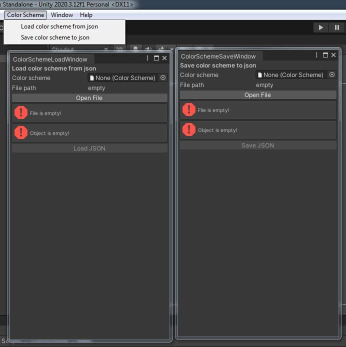
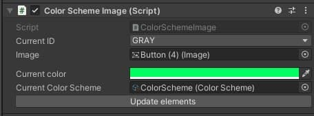
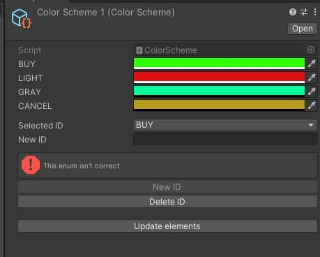
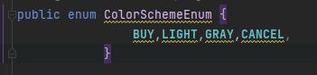
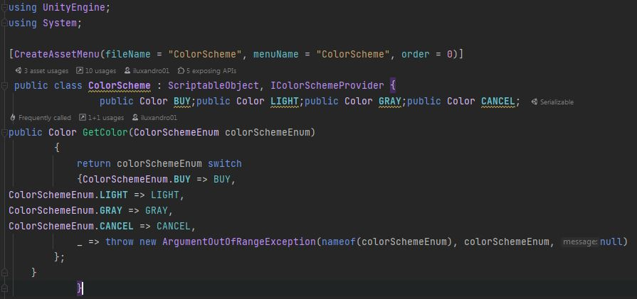
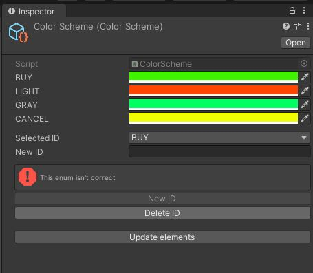

# ColorPalleteCodeGen
Цветовые палитры для геймдизайнеров с кодогенерацией

Идея данного проекта была взята из чата по Юнити.
Суть задачи заключалась в следующем:
* У многих UI элементов будет выбран ID, по которому из цветовой палитры будет выбираться соотвествующий цвет
* Цветовые палитры можно будет легко подменять
* Геймдизайнеры смогут добавлять и удалять ID
* Работа с JSON

Задача была реализована с помощью кодогенерации enum и SO, а также для удобства был написан кастомный редактор

# Демонстрация проекта
|   |   |   |
| :------------ |:---------------:| -----:|
|       |  |  |

